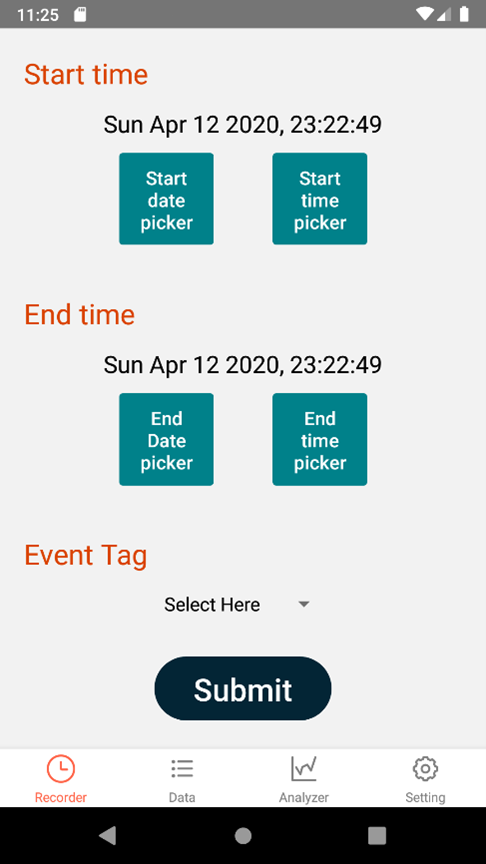
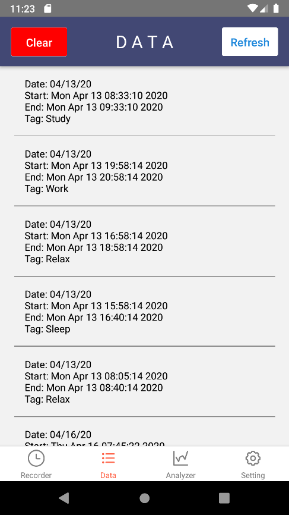
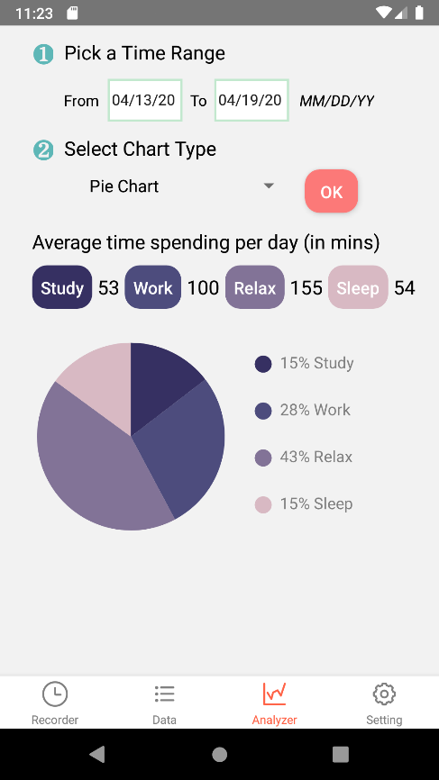
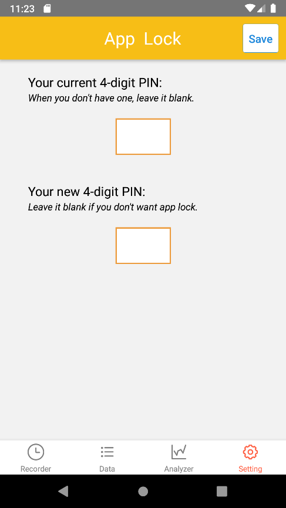

# Time-Tracking-App

## Intro
This is the app code based on React native. Spring 2020 coursework.

I use Javascript for this app.

## Screenshots





## Data Storage
Data storage is implemented via AsyncStorage.
Simple text encryption is implemented.
For more info, see *Manual Test.pdf*.

## Environment
Please follow https://reactnative.dev/docs/environment-setup to setup your environment.
- Software: Android Studio
- Environment: React Native CLI

## Run
- In Windows 10, open cmd.exe and run the following command.
```
npx react-native run-android
```

## Test
- In Windows 10, open cmd.exe and run the following command.
```
yarn test
```
